```mermaid
graph TD
    A[🎯 Objetivo 2025: Prácticas Preprofesionales] --> B{📚 Plan de Desarrollo}
    
    B --> C[💻 Backend Development]
    B --> D[📊 Data Analysis]  
    B --> E[🛠️ DevOps Basics]
    B --> F[🗄️ Database Skills]
    
    C --> G[🚀 Proyectos Reales]
    D --> G
    E --> G
    F --> G
    
    G --> H[✅ Portfolio Profesional]
    
    style A fill:#1e40af,stroke:#fff,stroke-width:2px,color:#fff
    style B fill:#3b82f6,stroke:#fff,stroke-width:2px,color:#fff
    style C fill:#be185d,stroke:#fff,stroke-width:2px,color:#fff
    style D fill:#059669,stroke:#fff,stroke-width:2px,color:#fff
    style E fill:#4f46e5,stroke:#fff,stroke-width:2px,color:#fff
    style F fill:#f59e0b,stroke:#fff,stroke-width:2px,color:#fff
    style G fill:#7c3aed,stroke:#fff,stroke-width:2px,color:#fff
    style H fill:#ea580c,stroke:#fff,stroke-width:3px,color:#fff
```

# ¡Hola! Soy Álvaro Correa 👋

<div align="center">
  
</div>

<p align="center">
  <a href="https://www.linkedin.com/in/alvarocorreagastelo/" target="_blank">
    
  </a>
  <a href="mailto:acorreag19@hotmail.com">
    
  </a>
  
</p>

---

## 🚀 Sobre Mí

**Estudiante de Ingeniería de Sistemas** en la Universidad Tecnológica del Perú (UTP), apasionado por **transformar ideas en soluciones tecnológicas** eficientes y escalables. Mi enfoque principal es el **desarrollo backend** y el **análisis de datos**.

🏆 **Miembro de programas de excelencia:** Generación TOP e Impulsa UTP  
💡 **Filosofía:** Convertir problemas complejos en soluciones elegantes

### 🎯 Estado Actual
```javascript
const alvaro = {
    código: ["Java", "Python", "SQL"],
    arquitectura: ["Microservicios", "API REST", "MVC"],
    herramientas: ["Spring Boot", "Docker", "Git"],
    bases_de_datos: ["MySQL", "PostgreSQL"],
    actualmente_aprendiendo: ["AWS", "Ciberseguridad", "DevOps"],
    objetivo_2025: "Conseguir práctica preprofesional en desarrollo backend",
    dato_curioso: "Me encanta desarmar problemas complejos 🧩"
};
```

---

## 🛠️ Stack Tecnológico

<div align="center">

### 💻 Lenguajes de Programación


### 🎯 Frameworks & Librerías


### 🗄️ Bases de Datos


### 🔧 Herramientas & DevOps


### 💼 IDEs & Editores


### 📊 Análisis & Diseño


### 🖥️ Sistemas Operativos


</div>

---

## 📊 Estadísticas de GitHub

<div align="center">
  
  
</div>

<div align="center">
  
</div>

<div align="center">
  
</div>

---

## 🚀 Proyectos Destacados

### 🏨 Sistema POS de Alto Rendimiento
> **Aplicación de escritorio robusta** para automatizar operaciones de restaurante
- **Stack:** Java SE + Swing + MySQL + JasperReports
- **Características:** Gestión de inventario, facturación, reportes automatizados
- ⭐ **Impacto:** Reducción del 40% en tiempo de procesamiento de órdenes

### 🎬 Plataforma Cinematográfica con Microservicios
> **Evolución de monolito a microservicios** - Prueba de Concepto
- **Stack:** Java EE → Spring Boot + Docker + MySQL
- **Arquitectura:** API REST, containerización, escalabilidad horizontal
- 🔧 **Aprendizaje:** Migración exitosa de arquitectura monolítica


---

## 🌱 Actualmente Explorando

<div align="center">
## 🌱 Mi Roadmap de Desarrollo 2025

## 🌱 Mi Roadmap de Desarrollo 2025


</div>

---

## 🤝 Colaboremos Juntos

<div align="center">

### 🔍 Busco colaborar en:
🌟 **Proyectos Open Source** en Java/Python
🏗️ **Arquitecturas de Microservicios**
📊 **Soluciones de Análisis de Datos**
🚀 **APIs REST escalables**

### 💬 Hablemos de:
- Backend Development
- System Design
- Data Analysis
- Career Growth

</div>

---

<div align="center">
  
### 💭 *"El código es poesía, la arquitectura es arte, y la solución de problemas es ciencia"*

**¿Tienes una idea interesante? ¡Construyámosla juntos!** 🚀

---


</div>
